# Zotero pour les bibliothécaires : support de cours

## Objectifs

* Créer et organiser une bibliothèque de références bibliographiques et de PDF avec Zotero
* Utiliser les fonctionnalités de rédaction bibliographique de Zotero
* Intégrer Zotero à ses outils de travail
* Comprendre l'environnement de Zotero pour en optimiser et en augmenter l'usage

## Sommaire

<!-- MDTOC maxdepth:1 firsth1:0 numbering:0 flatten:0 bullets:1 updateOnSave:0 -->

- [Objectifs](#objectifs)   
- [Sommaire](#sommaire)   
- [0. Tour de table](#0-tour-de-table)   
- [1. Introduction](#1-introduction)   
- [2. Installer et configurer Zotero](#2-installer-et-configurer-zotero)   
- [3. Constituer sa bibliothèque Zotero étape 1, ajouter des documents et des fichiers](#3-constituer-sa-bibliothèque-zotero-étape-1-ajouter-des-documents-et-des-fichiers)   
- [4. Constituer sa bibliothèque Zotero étape 2, organiser le contenu avec les collections, marqueurs, recherches enregistrées, etc.](#4-constituer-sa-bibliothèque-zotero-étape-2-organiser-le-contenu-avec-les-collections-marqueurs-recherches-enregistrées-etc)   
- [5. Exploiter sa bibliothèque Zotero avec d'autres applications](#5-exploiter-sa-bibliothèque-zotero-avec-dautres-applications)   
- [6. Identifier et installer dans Zotero les styles bibliographiques de référence de son domaine](#6-identifier-et-installer-dans-zotero-les-styles-bibliographiques-de-référence-de-son-domaine)   
- [7. Citer avec Zotero - intégration avec le traitement de texte et annotation](#7-citer-avec-zotero-intégration-avec-le-traitement-de-texte-et-annotation)   
- [8. Citer avec Zotero - autres méthodes](#8-citer-avec-zotero-autres-méthodes)   
- [9.  De la bibliothèque Zotero à la bibliographie en ligne](#9-de-la-bibliothèque-zotero-à-la-bibliographie-en-ligne)   
- [10. Quel cas d'usage dans votre contexte professionnel?](#10-quel-cas-dusage-dans-votre-contexte-professionnel)   
- [11. Où vont vos données Zotero?](#11-où-vont-vos-données-zotero)   
- [12. Conclusion](#12-conclusion)   

<!-- /MDTOC -->

<div style="page-break-after: always;"></div>

## 0. Tour de table

* Qui êtes-vous?
* Quelles sont vos attentes pour ce stage?

Et que savez-vous déjà concernant Zotero?

🎯 Quiz 1 :  que savez-vous de Zotero et quels outils bibliographiques utilisez-vous?

## 1. Introduction

### Vue d'ensemble

Zotero est un **logiciel de gestion bibliographique**. Lorsque l'on utilise un logiciel de ce type, les tâches suivantes sont (plus ou moins) un processus en 1 clic :

* ajouter/importer des références bibliographiques,
* créer une bibliographie,
* citer au fil de l'écriture d'un mémoire, d'un article.

Toutes ces tâches techniques sont effectuées par le logiciel, mais il faut se souvenir que **ce dernier n'a pas de cerveau**. Cela signifie que l'utilisateur doit :

* vérifier si les informations bibliographiques sont correctes et complètes,
* trier et organiser ses références,
* sélectionner les références pertinentes à citer.

Zotero permet de résoudre les difficultés suivantes que l'on peut rencontrer lorsque l'on fait de la bibliographie sans logiciel (la liste n'est pas exhautive).

* Des tas de PDF en vrac avec des noms incompréhensibles
* Aucun lien entre vos références bibliographique, vos fichiers et vos notes
* Le copier-coller comme meilleure option lorsque vous effectuez des citations
* La nécessité de remettre en forme manuellement vos références

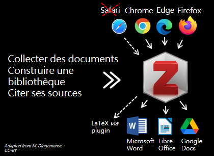

#### Note concernant Safari

Pourquoi Safari est-il barré ? Le connecteur Zotero existant pour Safari est beaucoup plus limité que celui pour Firefox, Chrome ou Edge. Par exemple, il ne prend pas en charge les fonctionnalités avancées telles que la **détection automatique de proxy** et **l'importation automatique de RIS/BibTeX**.

![zotero][zotero] [Base de connaissance Zotero : Connecteur Zotero et Safari](https://docs.zotero-fr.org/kb/safari_compatibility/)


### Zotero pour les bibliothécaires?

* Rédiger des bibliographies
* Mettre à disposition des bibliographies lisibles par les usagers **et par leur logiciel**
* Partager des bibliographies grâce aux groupes
* Exporter et importer des références bibliographiques entre différentes applications
* Organiser et gérer sa documentation professionnelle

... et plus largement pour des usages non académiques : [Discussion du forum Zotero : How/ Why do you use Zotero?](https://forums.zotero.org/discussion/79440/how-why-do-you-use-zotero)

### Zotero est un logiciel libre

Pourquoi est-ce important?

* Les utilisateurs peuvent contribuer au logiciel - voir [la liste complète des modules complémentaires à Zotero](https://www.zotero.org/support/https://www.zotero.org/support/plugins), et participer à la communauté des utilisateurs par le biais du [Forum Zotero](https://forums.zotero.org/).
* Le développement est agile et orienté vers les utilisateurs.
* Zotero est développé par une organisation à but non lucratif, sans intérêt financier pour vos données ; vous n'êtes pas obligé de créer un compte pour utiliser Zotero.

Vous trouverez davantage de détails et des exemples concernant cette questions dans le billet du blog Zotero francophone : [Pourquoi Zotero?](https://zotero.hypotheses.org/1998)

## 2. Installer et configurer Zotero

### Installer Zotero
![zotero][zotero] [Site web Zotero : Télécharger Zotero](https://www.zotero.org/download/)

Vous devez installer à la fois l'application Zotero **ET** le connecteur Zotero adapté à votre navigateur (Chrome, Firefox ou Edge).

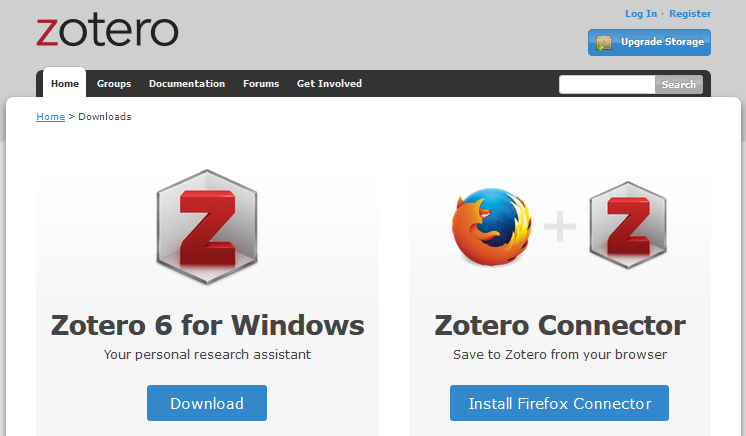

![zotero][zotero] [Documentation Zotero : Installation](https://docs.zotero-fr.org/installation/)

### Comment vérifier si l'installation a fonctionné ?

Pour profiter pleinement de Zotero, le logiciel doit être connecté à votre navigateur et votre traitement de texte (Microsoft Word, LibreOffice Writer).

1. Vérifiez si Zotero est installé en ouvrant l'application sur votre ordinateur.
2. Ouvrez votre navigateur et vérifiez que Zotero apparaît dans la barre supérieure, à côté de la barre de recherche.
3. Ouvrez votre traitement de texte et vérifiez si l'extension Zotero est installée. En général, après l'installation de Zotero, un nouvel onglet apparaît dans votre traitement de texte. En fonction de votre logiciel, Zotero peut aussi être affiché avec d'autres "Compléments".

Si l'installation du module de traitement de texte n'a pas fonctionné, vous pouvez le réinstaller à partir de Zotero lui-même.

1. Ouvrez Zotero.
2. Allez à *Edition > Préférences* (ou *Zotero > Préférences* sur Mac OS).
3. Cliquez sur l'onglet *Citer*.
4. Cliquez sur le deuxième onglet _Traitements de texte_.
5. À ce stade, vous pouvez choisir d'installer ou de réinstaller un ou plusieurs modules pour traitement de texte, en fonction des logiciels de traitement de texte installés sur votre ordinateur.

![zotero][zotero] [Documentation Zotero : Modules pour logiciel de traitement de texte](https://docs.zotero-fr.org/word_processor_integration)

![zotero][zotero] [Documentation Zotero : Préférences](https://docs.zotero-fr.org/preferences)

### Configuration minimale des préférences

Voici quelques recommandations pour démarrer. Tous les paramétrages sont accessibles depuis les _Préférences_ de Zotero.

#### Onglet "Générales"

Rubrique "Gestion des fichiers"

* Décochez la case "**Faire une capture automatique de la page lors de la création de documents à partir de pages Web**", pour éviter d'encombrer votre bibliothèque avec des captures de toutes les pages Web que vous enregistrerez.
* Cochez la case "**Joindre automatiquement les fichiers PDF associés lors de l'enregistrement d'un document**", pour récupérer automatiquement les PDFs des articles lorsque vous êtes sur le site d'un éditeur ou tout autre site sur lequel le PDF est présent. Si vous êtes sur PubMed, Scopus ou une autre base de données bibliographiques, il faudra suivre le lien vers le site de l'éditeur pour enregistrer la référence bibliographique ET le PDF de l'article. Et il faudra bien sûr, s'il s'agit d'une ressource payante, que votre institution soit abonnée.
* Cochez la case "**Récupérer automatiquement les métadonnées des PDF**".

#### Onglet "Synchronisation"

Il n'est pas nécessaire de se créer un compte en ligne ni d'activer la synchronisation pour utiliser Zotero. C'est en revanche indispensable pour les deux fonctionnalités suivantes :

* la **synchronisation** de bibliothèques Zotero sur plusieurs appareils (un ordinateur professionnel et un ordinateur personnel par exemple) et sur le serveur en ligne Zotero,
* les **groupes** pour créer des bibliothèques partagées.

Nous allons recourir à cette fonctionnalité de groupe en utilisant la bibliothèque de groupe créée pour le stage.

Pour faire apparaître cette bibliothèque de groupe dans Zotero, vous devez configurer la synchronisation Zotero.

Ces paramètres sont accessibles depuis les _Préférences_ > _Synchronisation_.

Pour démarrer, nous nous en tenons aux paramètres suivants, après la saisie de votre nom d'utilisateur et de votre mot de passe.

##### Synchronisation des données

Cochez _Synchroniser automatiquement_.

##### Synchronisation des fichiers

* Décochez _Synchroniser les fichiers joints de ma bibliothèque en utilisant..._, sauf si vous avez vous-même coché cette case antérieurement et paramétré le service à utiliser pour la synchronisation de vos fichiers joints.
* Cochez _Synchroniser les fichiers joints dans les bibliothèques en utilisant le stockage de Zotero_.

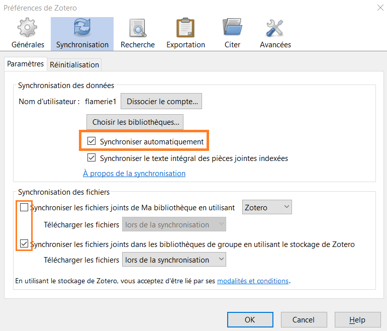

![zotero][zotero] [Documentation Zotero : Synchronisation](https://docs.zotero-fr.org/sync)

Une fois la synchronisation activée, vous devriez voir apparaître une nouvelle rubrique "Bibliothèques de groupe" dans Zotero, en-dessous de "Ma bibliothèque".

Dans cette rubrique, devrait s'afficher la bibliothèque de groupe que vous venez de rejoindre ; vous devriez y trouver une collection (icône dossier) à votre nom d'utilisateur Zotero.

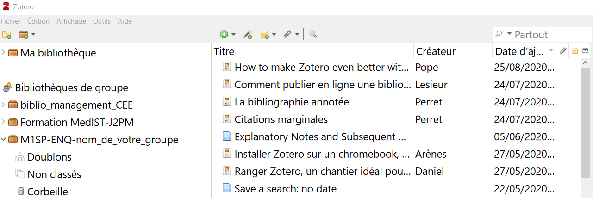


## 3. Constituer sa bibliothèque Zotero étape 1, ajouter des documents et des fichiers


Une référence bibliographique, un **document** dans votre bibliothèque Zotero, est constituée d'informations, de **métadonnées**, décrivant un article, un livre, etc. et vous permettant de le retrouver facilement par la suite. Zotero structure les métadonnées que vous collectez sur les documents. Lorsque vous citez vos documents avec Zotero, il génère alors des bibliographies cohérentes. Zotero vous permet également de stocker des fichiers numériques avec les références, sous forme de **pièces jointes**.

### Enregistrer des documents dans votre navigateur

C'est la méthode  :

* **la plus simple**,
* **la plus fiable**,
* **la plus recommandée**,

pour ajouter des documents dans votre bibliothèque.

Le connecteur Zotero est l'extension que vous avez installée dans votre navigateur. Cette extension détecte les références bibliographiques disponibles sur les pages que vous visitez.

Ouvrez Zotero et cliquez sur le bouton "_Save to Zotero_" de votre navigateur pour enregistrer la référence bibliographique en tant que document dans votre bibliothèque Zotero. Zotero essaie également d'enregistrer en même temps le fichier PDF en texte intégral en tant que pièce jointe.

Exemple : [un article de la revue "Documentation et Bibliothèques"](https://doi.org/10.7202/1076996ar)

#### Exercice "Enregistrer des documents depuis les sites en ligne avec le connecteur Zotero"

Nous prenons **10 minutes** pour cette activité.

En naviguant sur les sites que vous utilisez habituellement pour vos recherches bibliographiques, enregistrez de nouveaux documents dans la collection à votre nom dans la bibliothèque de groupe du stage.

Vous pouvez enregistrer des livres, de articles de revue, des thèses, ou encore des liens vers des pages web, des articles de presse ou de magazine, le tout est de tester l'enregistrement dans Zotero depuis les sites que vous consultez. Ajoutez des fichiers (pdf, jpg ou autres) si applicable.

📚 Pour les livres, quelle source privilégierez-vous? Le Sudoc, le catalogue de la BnF, amazon, autre?
Exemple : rechercher le livre ayant pour titre "Les hommes de mes livres: Roland Barthes, José Corti, Pierre Fanlac" dans ces 3 sources.

### Toutes les méthodes d'ajout

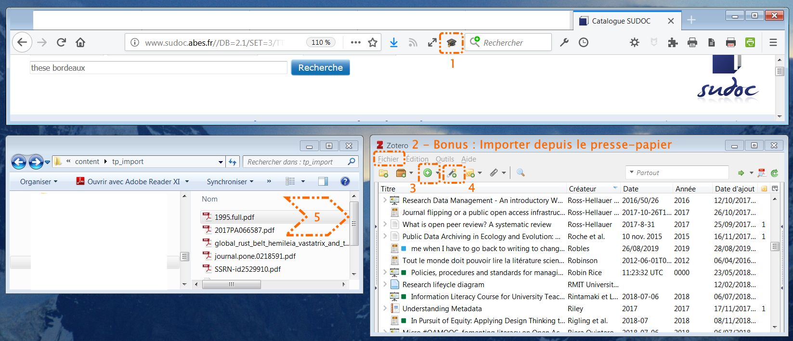

#### 1, le connecteur Zotero
C'est la méthode que nous venons d'utiliser.

#### 2, importer un fichier ou importer depuis le presse-papier

Certaines bases de données ou catalogues peuvent vous fournir un fichier téléchargeable contenant une ou plusieurs références. Les formats les plus courants pour ce type de fichiers sont RIS (.ris) ou BibTeX (.bib). Cela est surtout utile pour les exportations à grande échelle ou lors d'un changement de logiciel de gestion bibliographique.

💡 **Conseil : sur certains sites, cet export est mieux configuré que l'enregistrement par le connecteur Zotero.**

#### 4, avec un identifiant unique

La baguette magique permet d'ajouter un document ou un lot de documents à partir de leur identifiant.

Les identifiants pris en charge sont les suivants :

* DOI,
* ISBN,
* identifiant PubMed, le PMID,
* identifiant arXiv Id,
* bibcode ADS.

Si vous disposez d'un fichier Excel comportant une colonne "ISBN" correctement renseignée, alors vous pouvez ajouter très facilement un lot d'ouvrages dans votre bibliothèque Zotero.

#### 5, depuis des PDF

Si vous avez déjà des PDF sur votre ordinateur, il peut être possible d'en récupérer les métadonnées a posteriori.

⚠️ **Cela n'est pas la méthode par défaut recommandée**.  Cette fonctionnalité est utile pour traiter un lot de PDF que vous avez en stock, mais cela ne doit pas être votre méthode habituelle pour ajouter du contenu à votre bibliothèque Zotero.

Pour ajouter un PDF à Zotero, il suffit de le faire glisser depuis un dossier et de le déposer dans votre bibliothèque. Zotero recherche automatiquement les métadonnées et crée automatiquement un document attaché au fichier PDF lorsque cela est possible. Cependant, il se peut que le PDF que vous avez ajouté à votre bibliothèque Zotero ne soit pas lisible par la machine ou ne soit pas reconnu par Zotero. Dans ce cas, aucune métadonnée ne sera récupérée. Vous devrez ajouter des métadonnées à l'aide d'un identifiant (DOI, ISBN,etc.) ou manuellement, en utilisant la fonction _Créer un document parent_.

Vous pouvez également récupérer des métadonnées pour plusieurs PDF en même temps.

Exemple : un PDF envoyé par un collègue

![zotero][zotero] [Documentation Zotero : Récupérer les métadonnées des PDF](https://docs.zotero-fr.org/retrieve_pdf_metadata)

#### 3, manuellement

Parfois, il n'y a pas de métadonnées disponibles encodées dans la page web que vous visitez ou le document que vous avez entre les mains n'est pas indexé dans un catalogue en ligne. Vous devrez alors créer ou modifier la référence vous-même.

Dans Zotero, vous pouvez créer un nouveau document en cliquant sur *Fichier > Nouveau document* ou sur le cercle vert avec un plus. Dans les deux cas, vous devrez choisir **le type de document** pour lequel vous souhaitez créer un document (par exemple, "Livre", "Rapport", etc.). Lorsque vous sélectionnez le type de document, un document vide apparaît. Vous pouvez alors remplir les champs en fonction du document que vous avez devant vous. Dans tous les cas, il est préférable d'être exhaustif et de donner le plus d'informations possible.

#### Exercice "Autres méthodes pour ajouter des documents"

Nous prenons **10 minutes** pour cette activité.

Ajoutez des documents en utilisant l'une des méthodes suivantes.

* **Baguette magique** : utilisez [cette liste de DOI](https://github.com/fflamerie/zotero_bibpro/blob/master/docs/zotero_bibpro_import-DOI.txt).
* **Saisie manuelle** : un rapport interne, une présentation ou tout autre document que vous ne trouvez pas en ligne.
* **Import de fichier** : utilisez [ce fichier RDF](https://raw.githubusercontent.com/fflamerie/zotero_bibpro/main/docs/zotero_bibpro_import.rdf).
* **A partir d'un PDF** : utilisez [les fichiers de ce dossier](https://github.com/fflamerie/zotero_bibpro/blob/master/docs/import-PDF).

### Vérifier et mettre à jour les documents que vous avez enregistrés

N'oubliez pas de vérifier et de modifier les documents que vous enregistrez dans votre bibliothèque, cela fait partie de l'ajout de contenu !

Zotero propose des fonctions intelligentes pour rendre cela plus facile et plus rapide que d'effectuer chaque modification entièrement manuellement. Par exemple :

* cliquez avec le bouton droit de la souris sur le contenu d'un champ `Créateur` pour inverser le nom et le prénom,
* cliquez avec le bouton droit de la souris sur le contenu d'un champ `Titre` pour transformer le texte avec toutes les _Initiales en Majuscules_ ou seulement une _Lettre capitale en début de phrase_  (et inversement),
* etc.

Quelle que soit la méthode que vous utilisez pour ajouter des documents dans votre bibliothèque, il peut y avoir des coquilles à corriger ou des informations à ajouter.

![zotero][zotero] [Documentation Zotero : Ajouter des documents à Zotero](https://docs.zotero-fr.org/adding_items_to_zotero/)

![zotero][zotero] [Base de connaissance Zotero : Comment puis-je mettre en forme certains mots d'un titre: par ex. en italique, en exposant ou en indice ?](https://docs.zotero-fr.org/kb/rich_text_bibliography/)


### Anticiper vos usages
Anticipez vos usages bibliographiques : pourquoi collectez-vous ces documents? S'agit-il de recenser et d'organiser uniquement votre documentation professionnelle? Ou de produire une bibliographie à destination du public? Quel est le niveau de détails attendu? Les informations complémentaires à ajouter?

Ainsi, si vous constituez une bibliothèque d'images pour illustrer vos supports de communication, il peut être utile d'enregistrer l'information concernant les conditions de réutilisation et de reporter la **licence Creative Commons** dans le champ "Autorisations". Cela est fait automatiquement lorsque vous enregistrez une image depuis Flickr.

Faut-il pour chaque livre enregistrer les **date, lieu et éditeur commercial originaux**? Si oui, recherchez-les et enregistrez-les en même temps que vous créez le document dans votre bibliothèque Zotero.

![zotero][zotero] [Base de connaissance Zotero : Les types de documents et les champs associés dans Zotero > Champs citables non inclus dans Zotero](https://docs.zotero-fr.org/kb/item_types_and_fields/#champs-citables-non-inclus-dans-zotero)


## 4. Constituer sa bibliothèque Zotero étape 2, organiser le contenu avec les collections, marqueurs, recherches enregistrées, etc.

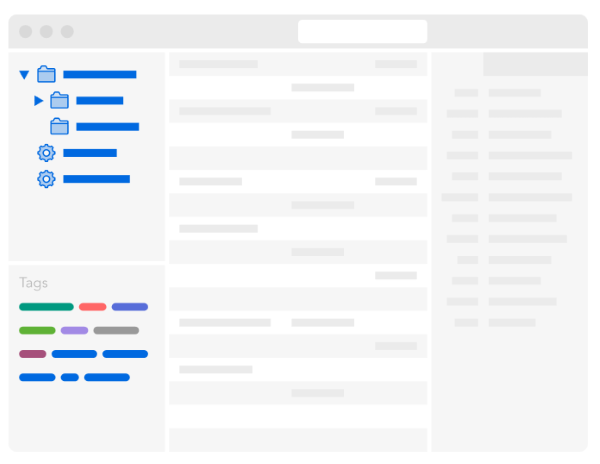

Indépendamment du logiciel utilisé et de la volumétrie à considérer, voici les principales caractéristiques souhaitables pour une bibliothèque personnelle.

* Elle offre de nombreux moyens de recherche et de navigation.
* Elle comporte des informations bibliographiques de référence, complètes et exactes.
* Elle facilite l'étude et la prise de notes.

### Les principaux outils pour organiser votre bibliothèque

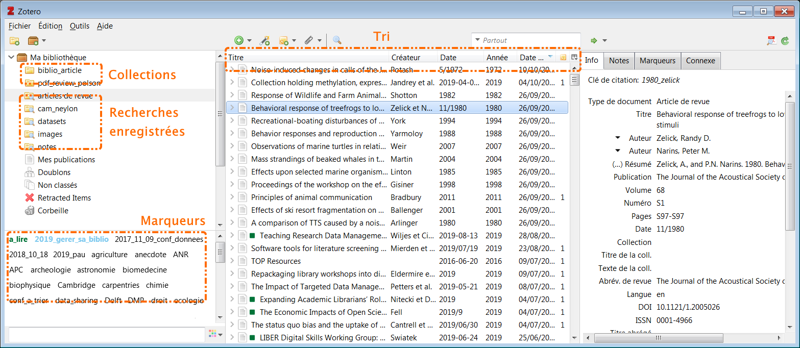

Nous nous concentrons sur les fonctionnalités les plus utiles lorsque l'on commence  une bibliothèque, c'est-à-dire :

* les marqueurs,
* les recherches -> rapide vs. avancée, immédiate vs. sauvegardée avec mise à jour dynamique,.
* les notes.

⚠️ Dans Zotero, l'icône associée à une **collection** est un dossier, mais les collections ressemblent plus à des **listes de lecture musicales** (pensez à iTunes, Spotify, etc.) qu'à des dossiers dans le système de fichiers de votre ordinateur.

### Exercice "Démarrer avec l'organisation"

Nous prenons **10 minutes** pour cette activité.

#### Indexer avec les marqueurs

* Créez un marqueur **a_lire**.
* Associez-lui une couleur.
* Ajoutez ce marqueur à tous les documents de votre bibliothèque d'un seul coup : comment faire ? 2 méthodes sont possibles.
* Combien de marqueurs de couleur pouvez-vous créer ?

#### Chercher

* Recherche rapide : quelle différence faites-vous entre une recherche dans `Champs & Marqueurs` et une recherche dans `Partout` ?
* Créez une recherche sauvegardée pour récupérer tous les articles marqués **a_lire** ET ajoutés dans votre bibliothèque au cours des 7 derniers jours.

#### Prendre des notes

* Pouvez-vous créer différents types de notes ?
* Quel usage feriez-vous des notes ?

Avec Zotero 6 Zotero propose un nouvel éditeur de notes aux fonctionnalités étendues, en lien avec un lecteur de PDF permettant notamment d'annoter les PDF. Nous détaillerons ces fonctionnalités avancées dans la section **7. Citer avec Zotero : intégration avec le traitement de texte et annotation**.

### Conserver ou non les marqueurs enregistrés automatiquement?

Par défaut, Zotero enregistre automatiquement les mots-clés associés au document dans la base à partir de laquelle vous l'avez enregistré  : indexation Rameau dans le Sudoc, mots-clés auteur dans les sites d'éditeur et les bases de données bibliographiques, indexation contrôlée dans les bases de données bibliographiques. Tous ces termes hétérogènes accumulés peuvent finir par produire une liste de termes redondants (synonymes, variantes diverses d'un même mot) difficile à exploiter, et qui vienne parasiter votre liste de marqueurs personnels.

Vous pouvez désactiver cet enregistrement depuis les _Préférences_ > _Générales_ > _Divers_ > _Ajouter automatiquement aux documents des marqueurs à partir des mots-clés fournis_.

Notez toutefois que même en décochant cette cas vous enregistrerez toujours les mots-clés associés lorsque vous ajoutez des documents via un **import de fichier** et non via le navigateur. Décocher cette case ne désactive pas l'import du champ _keywords_ (ou équivalent) présent dans un fichier bibliographique. Il y a donc de fortes chances que vous retrouviez tout de même des marqueurs ajoutés automatiquement dans votre bibliothèque. Par ailleurs, il est parfois utile de se référer aux mots-clés auteur ou aux indexations contrôlées d'une base de données.

Pour conserver une liste de marqueurs personnels propre, facile à exploiter et bien distincte des marqueurs ajoutés automatiquement, la meilleure option est par conséquent de **préfixer** ses marqueurs personnels au moyen d'un signe typographique tel que le tiret bas `_`. Vos marqueurs personnels seront ainsi non seulement facilement identifiables, mais toujours présentés en premier dans le sélecteur de marqueurs.

### Les recherches sauvegardés pour automatiser l'organisation

💡 **Conseil : laissez Zotero travailler pour vous**

N'oubliez pas que le classement des articles dans les collections, l'ajout de marqueurs, etc. nécessitent une saisie manuelle et prennent du temps. **Les recherches sauvegardées** sont un excellent moyen de gagner du temps et de l'efficacité, en utilisant automatiquement les informations que vous avez récupérées et ajoutées pour chaque document.

Les recherches sauvegardées prennent en charge une syntaxe relativement riche.
Pour retrouver toutes les références pour lesquelles un champ est vide, par exemple les références sans résumé, il suffit de créer une recherche sur le modèle suivant :

```
Résumé -- Ne contient pas -- %
```

### Ressources pour organiser sa bibliothèque

![zotero][zotero] [Documentation Zotero : Détection des doublons](https://docs.zotero-fr.org/duplicate_detection)

![zotero][zotero] [Documentation Zotero : Collections et marqueurs](https://docs.zotero-fr.org/collections_and_tags)

![zotero][zotero] [Documentation Zotero : Rechercher](https://docs.zotero-fr.org/searching)

![zotero][zotero] [Documentation Zotero : Tri](https://docs.zotero-fr.org/sorting)

![zotero][zotero] [Documentation Zotero : Notes](https://docs.zotero-fr.org/notes)

![zotero][zotero] [Documentation Zotero : Documents connexes](https://docs.zotero-fr.org/related)

Billets du blog Zotero francophone :

* [Comment organiser sa bibliothèque?](https://zotero.hypotheses.org/756)
* [Optimiser l’organisation de sa bibliothèque](https://zotero.hypotheses.org/3298)

Exemples d'organisations de bibliothèque Zotero par des utilisateurs : [ressources associées au billet "Comment organiser sa bibliothèque?" dans la bibliothèque de groupe zfrancophone](zotero://select/groups/2233096/collections/SZEXH6L3)

## 5. Exploiter sa bibliothèque Zotero avec d'autres applications

### Exporter des références dans un autre format

Zotero accepte les formats les plus courants des logiciels bibliographiques en import et en export, les formats RIS (.ris) et BibTex (.bib).

Exemple d'une notice au format RIS

```
TY  - BOOK
TI  - Histoire du communisme au XXe siècle
AU  - Ducoulombier, Romain
AB  - La 4e de couv. indique : "Le régime bolchevique aurait pu ne pas survivre aux événements qui l'ont fait naître entre 1917 et 1921. Mais l'expérience de la guerre civile russe a été la matrice d'un État nouveau et improvisé, devenu la terre promise et le modèle d'un vaste mouvement communiste dont l'existence a marqué le XXe siècle. L'ouverture des archives soviétiques consécutive à l'effondrement de l'URSS en 1991 et la disparition ou la mutation progressive de presque tous les Etats communistes ont fait entrer l'étude du communisme dans une période nouvelle. A la richesse d'historiographies nationales très vivaces mais cloisonnées, s'ajoute désormais l'ambition d'appréhender ce phénomène politique, économique et social dans son ensemble, de façon transnationale et comparée. Romain Ducoulombier nous invite à relire l'histoire du communisme au XXe siècle à l'aune des connaissances les plus récentes. Il compose ainsi un remarquable essai d'histoire globale."
CY  - Paris
DA  - 2014///
PY  - 2014
DP  - Library Catalog - www.sudoc.abes.fr
SP  - 127
LA  - français
PB  - Presses universitaires de France
SN  - 978-2-13-062612-1
ER  -
```

Exemple de la même  notice au format BibTex

```
@book{2014_ducoulombiera,
	address = {Paris},
	title = {Histoire du communisme au {XXe} siècle},
	isbn = {978-2-13-062612-1},
	abstract = {La 4e de couv. indique : "Le régime bolchevique aurait pu ne pas survivre aux événements qui l'ont fait naître entre 1917 et 1921. Mais l'expérience de la guerre civile russe a été la matrice d'un État nouveau et improvisé, devenu la terre promise et le modèle d'un vaste mouvement communiste dont l'existence a marqué le XXe siècle. L'ouverture des archives soviétiques consécutive à l'effondrement de l'URSS en 1991 et la disparition ou la mutation progressive de presque tous les Etats communistes ont fait entrer l'étude du communisme dans une période nouvelle. A la richesse d'historiographies nationales très vivaces mais cloisonnées, s'ajoute désormais l'ambition d'appréhender ce phénomène politique, économique et social dans son ensemble, de façon transnationale et comparée. Romain Ducoulombier nous invite à relire l'histoire du communisme au XXe siècle à l'aune des connaissances les plus récentes. Il compose ainsi un remarquable essai d'histoire globale."},
	language = {français},
	publisher = {Presses universitaires de France},
	author = {Ducoulombier, Romain},
	year = {2014}
}
```

Zotero  accepte également bien d'autres formats en import comme en export.

* En **import**, citons les formats texte complets de bases de données (PubMed, Web of Science, etc.)

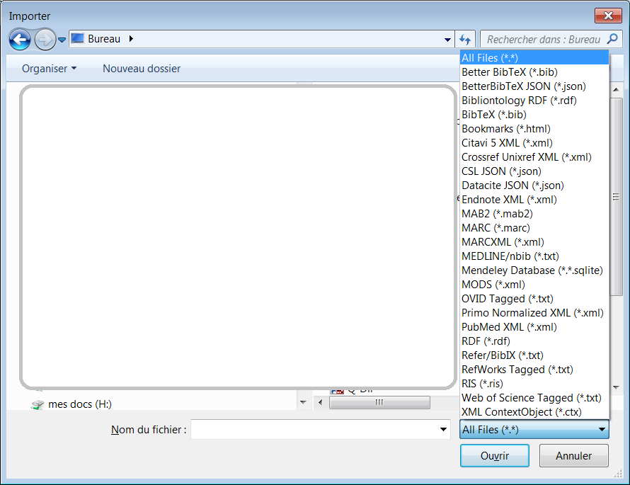

* En **export**, citons notamment CSV.

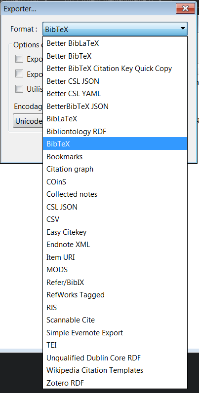

#### Ressources

![zotero][zotero] [Documentation Zotero : Comment importer depuis BibTeX ou d'autres formats standards? ](https://www.zotero.org/support/fr/kb/importing_standardized_formats)

[Article Wikipedia RIS_(format de fichier)](https://fr.wikipedia.org/wiki/RIS_(format_de_fichier))

Billets du blog Zotero francophone

* [Migration vers Zotero](https://zotero.hypotheses.org/2766)
* [Zotero et Latex](https://zotero.hypotheses.org/762)
* [Zotero pour les revues de littérature](https://zotero.hypotheses.org/4359) > [Personnaliser un export .CSV](https://zotero.hypotheses.org/4359#section05)

### Du traitement de texte à Zotero

Nous verrons ultérieurement comment aller de Zotero au traitement de texte pour produire un texte comportant des citations et une liste de références ou pour générer une bibliographie indépendante, ce qui correspond à l'un des usages les plus fréquents d'un logiciel de gestion bibliographique. On doit ou on souhaite parfois pouvoir procéder à rebours, c'est-à-dire extraire d'un document rédigé des références bibliographiques pour les intégrer dans une bibliothèque Zotero.

Les outils ci-dessous permettent d'effectuer cela, toutefois il convient de souligner que la plupart d'entre eux ne feront qu'extraire ce qui est présent dans le document source : pour obtenir un résultat fiable, complet et exact, il faut donc que la bibliographie du document source présente ces mêmes qualités.

#### Reference Extractor pour extraire des références insérées avec Zotero ou Mendeley

Ce cas n'est malheureusement peut-être pas celui que vous rencontrez le plus souvent. Si vous disposez d'un fichier correspondant aux caractéristiques suivantes, alors [Reference Extractor](http://rintze.zelle.me/ref-extractor/) est l'outil le plus adapté.

* Le fichier est au format **.docx** ou **.odt**,
* les citations sont toujours actives et n’ont pas été converties en texte.

#### Anystyle.io et compagnie pour extraire des références d'un texte

La plupart du temps, vous devez probablement partir d'une liste bibliographique simple.

Les outils suivants peuvent alors vous être utiles.

*  [anystyle.io](https://anystyle.io/) analyse le texte soumis dans l'interface en ligne et le convertit en références bibliographiques exploitables informatiquement.
* [Citation Finder](https://citation-finder.vercel.app/) recherche quant à lui les documents en ligne : cela donne l'assurance d'obtenir des références bibliographiques complètes et exactes, mais ne permet pas de traiter les références de documents non indexés.

Si vous avez une très grande bibliographie dans Word à importer dans Zotero, la combinaison des deux premiers outils sera sans doute la meilleure solution : Citation Finder pour traiter d’abord tout ce qui est disponible en ligne, puis anystyle.io pour le reste.

#### Exercice "Extraire les références de la bibliographie d'un document Word ou PDF"

Nous prenons **10 minutes** pour cette activité.

Importez les références de chacune des bibliographies dans Zotero, à l'aide des deux services mentionnés ci-dessus.

* [Fichier à utiliser avec Reference Extractor](https://github.com/fflamerie/zotero_bibpro/blob/main/docs/zotero_bibpro_ex_ref_extractor.docx)
* [Fichier à utiliser avec Anystyle.io](https://github.com/fflamerie/zotero_bibpro/blob/main/docs/zotero_bibpro_ex_anystyle.docx)

🧐 N'oubliez pas de relire, corriger et compléter les références importées!

#### Ressources

Billet du blog Zotero francophone

* [Bulletin de veille n° 2](https://zotero.hypotheses.org/3434) : anystyle.io, Reference Extractor et Citation Finder

![zotero][zotero] [Documentation Zotero : J'ai des bibliographies dans des documents Microsoft Word, des PDF, et d'autres fichiers textes. Puis-je les importer dans ma bibliothèque Zotero ?](https://www.zotero.org/support/fr/kb/importing_formatted_bibliographies)


## 6. Identifier et installer dans Zotero les styles bibliographiques de référence de son domaine

🎯 Quiz 2 : les styles bibliographiques

### Les types de style bibliographique

Un style bibliographique définit la façon dont les éléments bibliographiques d’un document doivent être organisés et mis en forme.

On considère 2 éléments.

*  Les **citations** : elles peuvent être insérées sous la forme d'appels de citation (nombre, nom de l'auteur et date, etc.) **dans le texte** ou de références plus ou moins abrégées **en note** de bas de page ou de fin.
*   La **bibliographie**.

On distingue différents types de style bibliographiques, correspondant à des formats de style Zotero différents. On trouve ainsi dans [l'entrepôt des styles Zotero](https://www.zotero.org/styles), plus de 10'000 styles regroupés en 2 grands ensembles :

*   les styles _**in-text**_, dans lesquels un appel de citation dans le texte renvoie à une entrée de la bibliographie,
*   les styles _**note**_, dans lesquels un marqueur (symbole, nombre, etc.) pointe vers une note de bas de page ou de fin, qui permet d’identifier le document cité.

#### Les styles _in-text_ numériques
Dans le texte : chaque référence citée est appelée par un **numéro**.

>Yeast cells were grown at 25°C in batch cultures on 0.5% methanol for 36 hours <span style="color:#0000CD;">[21, 22]</span>.

Dans la bibliographie : les références sont classées par **ordre d’apparition dans le texte**.

><span style="color:#0000CD;">21\.</span> Zwart KB, Veenhuis M, Harder W (1983) Significance of yeast peroxisomes in the metabolism of choline and ethanolamine. Antonie Van Leeuwenhoek 49: 369-385.
>
><span style="color:#0000CD;">22\.</span> van der Klei IJ, Harder W, Veenhuis M (1991) Methanol metabolism in a peroxisome-deficient mutant of Hansenula polymorpha: a physiological study. Arch Microbiol 156: 15-23.

#### Les styles _in-text_ numériques composites
Les styles numériques composites, dans lesquels une entrée bibliographique peut contenir plusieurs références, sont très utilisés en chimie.

**Ce type de style n'est pas pris en charge par CSL, le langage dans lequel sont écrits les styles bibliographiques utilisés par Zotero.**

Dans le texte :

>Yeast cells were grown at 25°C in batch cultures on 0.5% methanol for 36 hours <span style="color:#0000CD;">(1)</span>

Dans la bibliographie :

><span style="color:#0000CD;">1\. a)</span> Zwart KB, et al. (1983) Antonie van Leeuwenhoek 49: 369-385, <span style="color:#0000CD;">b)</span> van der Klei IJ, et al. (1991) Arch Microbiol 156: 15-23.

#### Les styles _in-text_ auteur et auteur-date
Dans le texte : chaque référence citée est appelée par le **nom de l'auteur** ou **le nom de l'auteur et la date de publication**.

> Yeast cells were grown at 25°C in batch cultures on 0.5% methanol for 36 hours <span style="color:#0000CD;">(van der Klei et al. 1991; Zwart et al. 1983)</span>
>
>Yeast cells were grown at 25°C in batch cultures on 0.5% methanol for 36 hours <span style="color:#0000CD;">(van der Klei et al.; Zwart et al.)</span></cite>

Dans la bibliographie : les références sont classées par **ordre alphabétique d'auteur**.

>van der Klei IJ, Harder W, Veenhuis M (1991) Methanol metabolism in a peroxisome-deficient mutant of Hansenula polymorpha: a physiological study. Arch Microbiol 156: 15-23.
>
>Zwart KB, Veenhuis M, Harder W (1983) Significance of yeast peroxisomes in the metabolism of choline and ethanolamine. Antonie Van Leeuwenhoek 49: 369-385.

#### Les styles _in-text_ label
Dans le texte : chaque référence citée est appelée par un **code**.

>Yeast cells were grown at 25°C in batch cultures on 0.5% methanol for 36 hours <span style="color:#0000CD;">[ZwVH1983; vaHV1991]</span>.</cite>

Dans la bibliographie : les références sont classées par **ordre d’apparition dans le texte**.

><span style="color:#0000CD;">[ZwVH1983]</span> Zwart KB, Veenhuis M, Harder W (1983) Significance of yeast peroxisomes in the metabolism of choline and ethanolamine. Antonie Van Leeuwenhoek 49: 369-385.
>
><span style="color:#0000CD;">[vaHV1991]</span> van der Klei IJ, Harder W, Veenhuis M (1991) Methanol metabolism in a peroxisome-deficient mutant of Hansenula polymorpha: a physiological study. Arch Microbiol 156: 15-23.

Un seul style correspond à ce modèle dans l'entrepôt des styles, le style [DIN 1505-2 (alphanumeric, German)](https://www.zotero.org/styles/din-1505-2-alphanumeric).
Il présente 2 limites :

* il est monolingue en allemand,
* le schéma de construction du label ne peut pas être modifié.

Un label personnalisé peut être défini, mais cela devra être fait manuellement pour chaque référence.

* Pour chaque référence le label à utiliser devra être indiqué dans le champ _Extra_ de la notice Zotero, sous la forme : `citation-label: valeur_du_label`.
* Par conséquent, il faudra **désambiguïser** manuellement des labels qui seraient identiques mais se rapporteraient à des articles différents (même premier auteur et même année).

#### Les styles _note_
Dans le texte :

>"In the Island of St. Kilda, according to Martin, <span style="color:#0000CD;">[*]</span> the men do not acquire beards until the age of thirty or upwards, and even then the beards are very thin. “
>
><span style="color:#0000CD;">[*]</span>'Voyage to St. Kilda' (3rd edit. 1753), p. 37.

Dans la bibliographie : certains styles _note_ incluent une bibliographie de tous les documents cités. Les références sont en général classées **par ordre alphabétique d'auteur**.

Le format du marqueur doit être paramétré dans le **traitement de texte**.

**Exemple dans Word 2010**

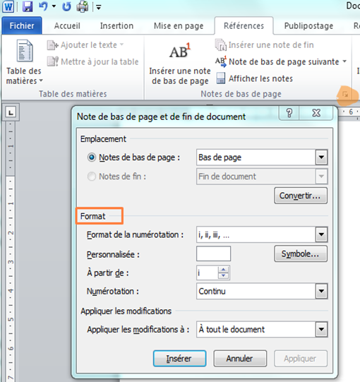

### Comment choisir un style bibliographique lorsqu'aucun n'est imposé?

Les critères de choix suivants peuvent être pris en compte.

#### Critère de choix 1, existence d'un modèle de référence
Existe-t-il un style de référence ou fréquemment utilisé dans votre domaine? Par exemple "Vancouver" et "American Psychological Association" pour les sciences de la santé, "Modern Language Association" pour certains domaines de la littérature, "IEEE" pour les sciences de l'ingénieur, etc.

Vous utilisez le style de l'ED droit de Bordeaux? Consultez la [Documentation du style CSL “Université de Bordeaux - École doctorale de droit (French)” pour Zotero](https://documentation-style-csl-ed-droit-ubx.readthedocs.io/en/latest/) : le site intègre toutes les spécificités de saisie et des exemples pour tous les types de document.


#### Critère de choix 2, typologie documentaire prise en charge
Citez-vous de nombreux types de documents différents? Tous les styles ne prennent pas en charge tous les types de documents. Le style _Nature_, par exemple, ne sera pas le plus adapté si vous citez des documents non publiés comme les thèses. La revue _Nature_ demande aux auteurs de citer un nombre restreint de types de document (voir les [instructions aux auteurs](http://www.nature.com.docelec.u-bordeaux.fr/nature/for-authors/formatting-guide), rubrique _References_), aussi le style CSL pour Zotero _Nature_ encode-t-il la mise en forme des citations uniquement pour ces types de document.

#### Critère de choix 3, langue de rédaction
Rédigez-vous seulement en français? Seulement dans une autre langue? Dans différentes langues selon les cas? Si certains styles sont agnostiques du point de vue de la langue, d'autres ont au contraire une langue prédéfinie qui ne peut pas être modifiée. Ainsi le style _Nature_ est-il paramétré uniquement pour la langue anglaise, selon la norme britannique.

Tous les styles "localisés" pour une langue autre que l'anglais comporte le nom de cette langue dans leur intitulé. Ainsi, rechercher **français** dans l'entrepôt des styles Zotero affichera uniquement les styles localisés pour la langue française. Les styles sans mention de langue sont soit "localisés" en anglais, soit agnostiques du point de vue de la langue.

#### L'aperçu des styles de Zotero pour comparer facilement différents styles bibliographiques

Zotero possède un outil intégré pour comparer les styles, l'_Aperçu des styles_, accessible depuis les _Préférences > Citer_.

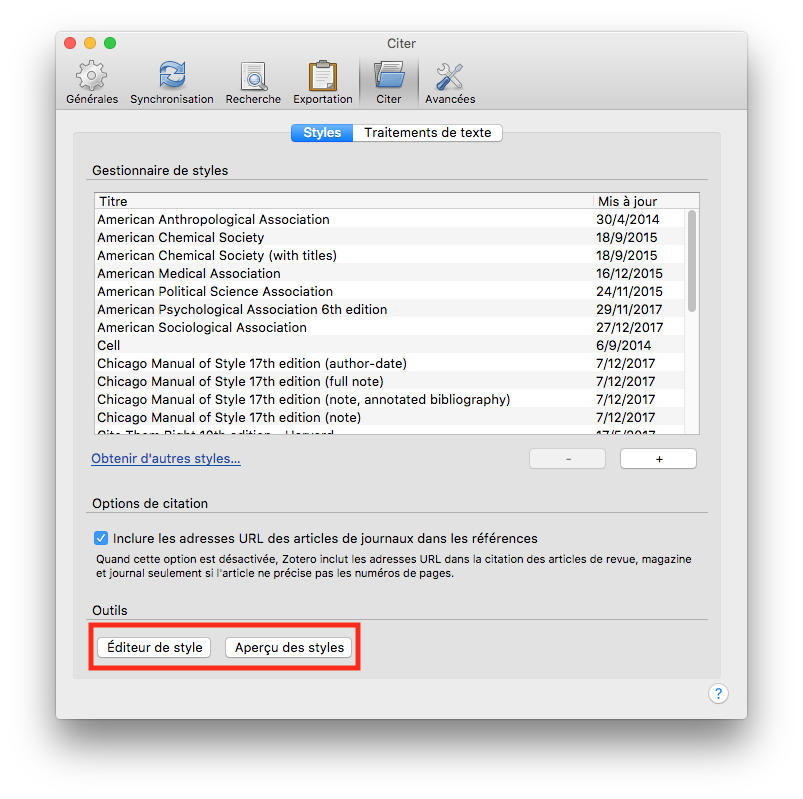

L'_Aperçu des styles_ vous permet de comparer rapidement tout ou partie des styles que vous avez installés, en générant des appels de citation et une bibliographie à partir de documents sélectionnés dans votre bibliothèque.

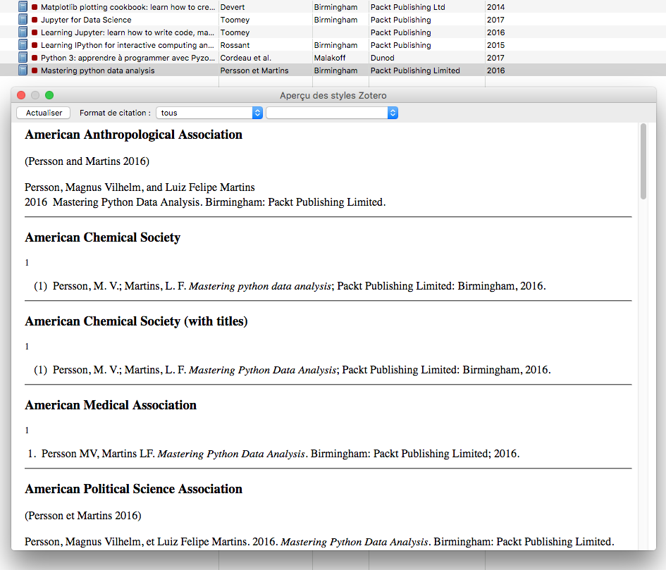

Afin que cet aperçu soit significatif et parlant, il importe de s'assurer de deux points.

Tout d'abord, assurez-vous que ces documents reflètent la **diversité de types de document** que vous allez citer (article, chapitre, mais aussi thèse ou encore brevet ou film ) : vous vérifierez ainsi que tous ces types sont bien pris en compte par les styles que vous comparez.

Ensuite, et surtout, assurez-vous que ces documents sont complets et exacts.

*  **S'il manque des informations bibliographiques**, il est logique que le style ne puisse pas les afficher lorsqu'il génère les citations et la bibliographie.
*  **Si vous faites un usage inadéquat ou détourné de certains champs**, vous générerez également une bibliographie détournée ou inadéquate, ne correspondant pas au résultat que produit le style normalement.

#### Comparatif de styles bibliographiques en SHS

Les bibliothèques universitaires de Nanterre proposent un tableau comparatif synthétique des styles suivants :

* APA 7ème édition (auteur-date),
* Petit Chicago (auteur-date),
* Tapuscrit (auteur-date),
* Presses universitaires de Rennes (note),
* Tapuscrit (note),
* Triangle (note),
* Université de Liège - Droit (note),
* Université de Bordeaux - Ecole doctorale de droit (note).

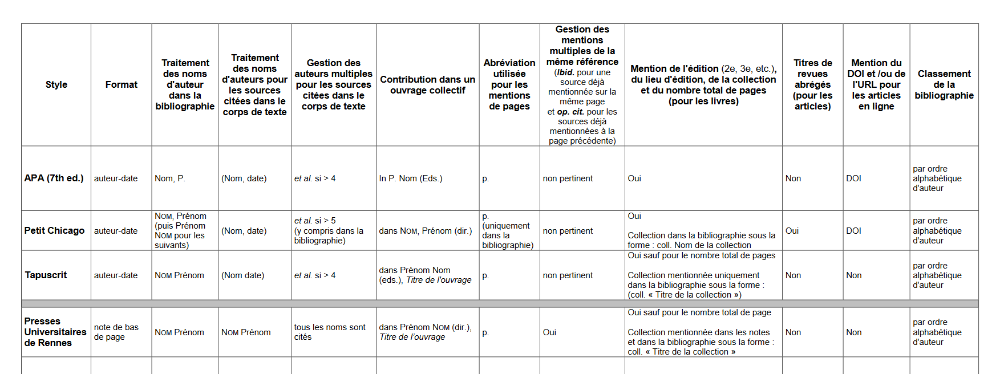

Voir : Willemin, E. (2022, avril 5). Quel style Zotero choisir pour son mémoire / sa thèse ? Université Paris Nanterre - Bibliothèques universitaires. http://bu.parisnanterre.fr/sautoformer/quel-style-zotero-choisir-pour-son-memoire-sa-these

### Ressources

![zotero][zotero] [Documentation Zotero : Les styles bibliographiques](https://docs.zotero-fr.org/styles)

![zotero][zotero] [Documentation Zotero : Préférences : Citer](https://docs.zotero-fr.org/cite/)

Modifier un style bibliographique : support de formation Urfist Bordeaux : [Créer des styles bibliographiques CSL](https://github.com/fflamerie/zotero_csl)

Modifier un style bibliographique : billet du blog Zotero francophone : [Apporter de petites modifications à un style bibliographique](https://zotero.hypotheses.org/3746)


## 7. Citer avec Zotero - intégration avec le traitement de texte et annotation


Bien sûr, vous pouvez appliquer les règles de citation à la main, mais Zotero sera plus rapide et plus cohérent. Voici ce que Zotero fera notamment :

* compter les auteurs et afficher _et al._ si nécessaire ;
* calculer, générer et mettre à jour des citations textuelles précises, qu'elles soient numériques ou sur le modèle auteur-date ;
* inclure toutes les références que vous avez citées dans votre texte dans la bibliographie ;
* trier cette bibliographie en fonction des exigences du style de citation ;
* gérer et corriger la ponctuation, les majuscules, les indentations ;
* _et bien plus encore..._

Il vous évite ainsi d'effectuer ces tâches répétitives pour vous permettre de vous concentrer sur les aspects de la citation qu'il ne prend pas en charge :

* la sélection des documents à citer,
* la complétude et l'exactitude des informations bibliographiques à indiquer.

### Exercice "Citer avec Zotero : les modules de traitement de texte"

Nous prenons **15 minutes** pour cette activité.

L'objectif est de reproduire exactement le résultat présenté dans le fichier de modèle remis sous forme imprimée et disponible au lien ci-dessous.

Le style bibliographique utilisé est un style auteur-date, le style **ISO-690 (author-date, no abstract, Français)**.

* [Fichier modèle à reproduire au format .PDF](https://github.com/fflamerie/zotero_bibpro/blob/master/docs/zotero_bibpro_TP_citer_MODELE.pdf)
* [Fichier d'exercice à modificer au format .DOC](https://github.com/fflamerie/zotero_bibpro/blob/master/docs/zotero_bibpro_TP_citer_EXERCICE.doc)

### Ressources : Zotero et les traitements de texte

[zotero][zotero] [Documentation Zotero : Créer des bibliographies](https://docs.zotero-fr.org/creating_bibliographies)

![zotero][zotero] [Documentation Zotero : Modules pour logiciel de traitement de texte](https://docs.zotero-fr.org/word_processor_integration)

Si vous utilisez d'autres logiciels que Word ou LibreOffice :

* Billet du blog Zotero francophone : [Zotero et LaTeX](https://zotero.hypotheses.org/762)
* Billet du blog Zotero francophone : [Markdown et Zotero](https://zotero.hypotheses.org/2258)

### Annoter et rédiger avec le lecteur de PDF et le nouvel éditeur de notes de Zotero

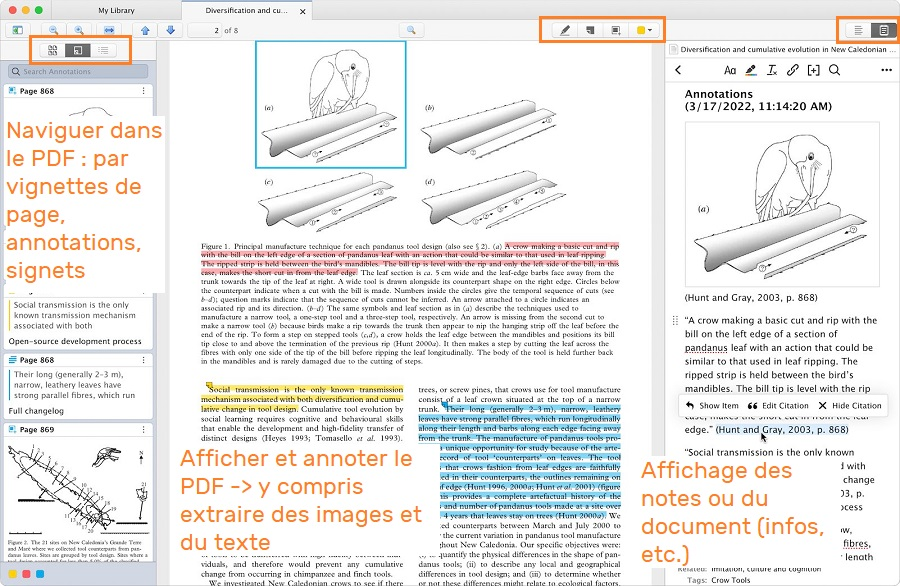

Les nouvelles fonctionnalités introduites par le lecteur de PDF et les outils d'annotation de Zotero permettent non seulement d'enrichir sa bibliothèque, mais également de préparer sa rédaction et ses citations dès la phase de lecture et d'annotation des textes.

Le lecteur de PDF intégré à Zotero depuis Zotero 6.0 offre notamment les fonctionnalités suivantes.

* Ouvrir les PDF dans un lecteur intégré à la fenêtre principale de Zotero, dans une interface à onglets.
* Modifier les informations bibliographiques d’un document tout en visualisant le PDF associé.
* Annoter les PDF avec des surlignages et des annotations d'image et d'extraits de texte, **en intégrant systématiquement les informations de citation**.
* **Ajouter les annotations dans des notes Zotero** : créer automatiquement une note à partir de toutes les annotations d'un PDF, ou ajouter des annotations provenant de différents PDF à une même note.
* **Citer depuis les annotations** :  le nouveau bouton "Add Note" dans le module de traitement de texte insère le contenu d'une note Zotero et les citations associées.

#### Stockage, import et export des annotations de PDF

* Les annotations créées dans le lecteur de PDF de Zotero ne sont pas lisibles directement dans un lecteur de PDF externe. Elles ne sont en effet pas stockées dans le fichier PDF mais dans votre base de données Zotero. Elles peuvent bien sûr être exportées.
* Zotero peut **importer les annotations** effectuées dans un lecteur de PDF externe, comme le faisait ZotFile.

#### Ressources pour annoter avec Zotero

![zotero][zotero] [Documentation Zotero : Le lecteur PDF et l'éditeur de notes de Zotero](https://docs.zotero-fr.org/pdf_reader)

![zotero][zotero] [Base de connaissance Zotero : Pourquoi Zotero stocke-t-il les annotations PDF dans sa base de données plutôt que dans le fichier PDF ?](https://docs.zotero-fr.org/kb/annotations_in_database)

Billet du blog Zotero francophone : [Zotero 6 : transformer votre flux de travail de recherche](https://zotero.hypotheses.org/4145)

📺 Vidéo de "La Boîte à outils des  historien·ne·s" concernant le lecteur de PDF de Zotero v6 :

Heimburger, F. (2022, avril 21). Découvrir Zotero 6 - Le lecteur de pdf et la prise de notes en vidéo. La boîte à outils des historien·ne·s. https://boiteaoutils.info/2022/04/decouvrir-zotero-6-le-lecteur-de-pdf-et-la-prise-de-notes-en-video/

📑Mini-tutoriels sur Twitter :

Bilal, M. (2022, août 30). Zotero 101 : A step-by-step guide with visuals [how to take notes and annotate PDFs in Zotero]. Twitter. https://twitter.com/MushtaqBilalPhD/status/1564522758696013824

Bilal, M. (2022, septembre 11). Zotero 101 : A step-by-step guide with visuals [how to make groups and do « collaborative annotations. »]. Twitter. https://twitter.com/MushtaqBilalPhD/status/1568829219383218179

Bilal, M. (2022, octobre 17). Zotero 101 : A step-by-step guide with visuals [how to supercharge your writing using Zotero’s Note Editor]. Twitter. https://twitter.com/MushtaqBilalPhD/status/1581927147685687297


## 8. Citer avec Zotero - autres méthodes

Zotero propose bien d'autres fonctionnalités pour la rédaction bibliographique en plus de l'intégration avec les traitements de texte.

* Insérer dans n'importe quel document (courriel, fichier .pptx, etc.) des références bibliographiques correctement mises en forme par un simple glisser-déposer : c'est la **Copie rapide**.
* Créer des bibliographies indépendantes dans différents formats (.html, .rtf) :  c'est le **menu contextuel** _Créer une bibliographie à partir des documents sélectionnés..._
* Créer des bibliographies dynamiques collaboratives en ligne, grâce à des bibliothèques partagées privées ou publiques : c'est l'une des fonctionnalités des **groupes** Zotero.

### Zotero pour contribuer à Wikipedia

Zotero propose non seulement un format d'export pour Wikipedia, mais plus encore la possibilité de configurer ce format pour qu'il soit automatiquement utilisé par la "Copie rapide" lorsque vous contribuez à Wikipedia.

Il suffit pour cela d'ajouter une ligne dans les _Préférences_ > _Exportation_ > _Paramètres spécifiques au site_. Le nom de domaine de Wikipedia est même proposé en exmple dans la fenêtre de l'assistant qui s'ouvre lorsque vous cliquez sur _Modifier_.

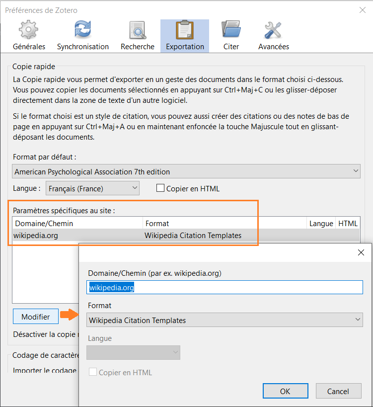

Lorsque vous souhaitez insérer une référence bibliographique dans une fiche Wikipedia, il suffit de la glisser-déposer depuis votre bibliothèque Zotero.

![zotero][zotero] [Documentation Zotero : Zotero et Wikipedia/ Wikidata](https://docs.zotero-fr.org/kb/zotero_and_wikipedia)

### Exercice "Citer avec Zotero : autres méthodes"

Nous prenons **5 minutes** pour cette activité.

Créez une bibliographie à partir des mêmes documents que ceux utilisés pour l'exercice précédent :

* avec la **copie rapide** ou le **menu contextuel**,
* en utilisant le style bibliographique **IEEE**.

Constatez-vous des différences avec le résultat produit avec le module de traitement de texte? Pour cela, n'hésitez pas à changer le style bibliographique dans le document Word que nous avons créé.

## 9.  De la bibliothèque Zotero à la bibliographie en ligne

🎯 Quiz 3 : les groupes Zotero

### Les groupes Zotero

Les **groupes Zotero** constituent un moyen simple de partager de la bibliographie, qu’il s’agisse de travailler de façon collaborative et privée avec d’autres personnes et/ou de diffuser des sélections bibliographiques auprès d’un public plus ou moins large.

Vous pouvez choisir de rendre publique votre bibliothèque Zotero personnelle, ce qui aura pour effet de permettre à tout internaute de consulter vos références bibliographiques. Ce paramétrage n’affecte pas les fichiers joints, qui demeurent accessibles de vous seul.

Le groupe Zotero constitue toutefois une bien meilleure option si vous souhaitez partager de la bibliographie.

En premier lieu, le groupe Zotero consiste en un **espace à part** distinct de votre bibliothèque personnelle : lorsque vous ajoutez un document depuis votre bibliothèque personnelle dans une bibliothèque de groupe, il est copié de votre bibliothèque vers cette bibliothèque de groupe. Si vous modifiez ce même document dans votre bibliothèque personnelle, les modifications ne sont pas répercutées dans la bibliothèque de groupe, et inversement. Vous distinguez ainsi nettement votre travail bibliographique personnel du travail bibliographique partagé. Il est bien sûr possible d’enregistrer un document directement dans la bibliothèque de groupe, sans effectuer de détour par votre bibliothèque personnelle.
Le groupe Zotero permet ensuite de définir très précisément qui a le droit de consulter ou modifier la bibliothèque de groupe, grâce à la combinaison des paramétrages suivants.

* Le **type de groupe** : privé, public à participation restreinte ou public à participation ouverte
* Les **membres du groupe** : rôle de membre, d’administrateur ou de propriétaire
* Les **droits accordés sur la bibliothèque** : lecture de la bibliothèque, édition de la bibliothèque, édition des fichiers

### Points d'attention concernant la synchronisation et les groupes

* Le **quota de 300 Mo** d’espace de stockage gratuit sur le serveur Zotero concerne les fichiers joints et non les références bibliographiques : si vous ne synchronisez pas vos fichiers joints vous n’aurez aucun problème de dépassement de votre espace de stockage. Pour les bibliothèques de groupe, l'espace de stockage est décompté sur le quota du propriétaire du groupe.
* Le compte en ligne vous permet d’**enregistrer des documents directement dans votre bibliothèque en ligne**. Vous pouvez ainsi ajouter des documents dans votre bibliothèque Zotero même si Zotero n’est pas installé sur l’ordinateur que vous utilisez. Il faut en revanche que le connecteur Zotero du navigateur internet soit installé, ou que vous utilisez l'ajout par identifiant.
* Vous retrouvez de fait dans votre bibliothèque en ligne une partie des fonctionnalités de votre bibliothèque locale,  à l’exception notamment des recherches enregistrées et des options de menu contextuel de modifications automatiques des champs (« Transformer le texte » pour les titre, « Inverser nom/prénom », etc.). A noter que l'application locale est indispensable pour l'interaction avec **les extensions de traitement de texte**.
* Si le droit de consulter la bibliothèque de groupe peut être accordé à tout internaute, **cette consultation est limitée aux références bibliographiques** : les fichiers joints demeurent toujours seulement accessibles aux membres du groupe.
* Veillez à **la bonne attribution des droits** en fonction de l’organisation souhaitée. Par exemple, si les droits des membres du groupe sont limités à la seule consultation de la bibliothèque, n’oubliez pas d’attribuer le rôle d’administrateur à toutes les personnes qui doivent ajouter des documents dans la bibliothèque ou les modifier.
* Un groupe Zotero n’implique pas forcément plusieurs contributeurs. Vous pouvez être le seul contributeur d’un groupe dont la bibliothèque peut être consultée par tous, ou encore vous pouvez créer un groupe simplement pour disposer d’une bibliothèque distincte de votre bibliothèque personnelle.
* Un **flux RSS** affiché sur la page de la bibliothèque en ligne du groupe permet de suivre les ajouts dans la bibliothèque. Il faut pour cela que le groupe soit public, et sa bibliothèque consultable par tous.

### Des exemples de groupe Zotero en bibliothèque

[Bibliotheque de droit (UdeM) - Vitrines thematiques](https://www.zotero.org/groups/2361517/bibliotheque_de_droit_udem_-_vitrines_thematiques)

[Bibliotheque Nancy Stanislas](https://www.zotero.org/groups/445257/bibliotheque_nancy_stanislas) : ressources bibliographiques relatives aux projets de la Bibliothèque Stanislas

[Bibliotheque.CentraleLyon](https://www.zotero.org/groups/61846/bibliotheque.centralelyon) : groupe de travail et d'échanges des professionels de la Bibliothèque Michel Serres de l'Ecole Centrale de Lyon

### Ressources concernant les groupes Zotero et la bibliothèque en ligne

![zotero][zotero] [Documentation Zotero : Les groupes Zotero](https://docs.zotero-fr.org/groups)

![zotero][zotero][Documentation Zotero : Synchronisation](https://docs.zotero-fr.org/sync)

![zotero][zotero][Documentation Zotero : Est-ce que la bibliothèque en ligne est identique à l’application de bureau Zotero ?](https://docs.zotero-fr.org/kb/web_vs_desktop/)

Billets du blog Zotero francophone

* [Bibliothèque de groupe : quelques pistes pour collaborer efficacement](https://zotero.hypotheses.org/1311)
* [Travailler avec plusieurs bibliothèques Zotero](https://zotero.hypotheses.org/1764)
* [Produire des bibliographies réutilisables avec Zotero](https://zotero.hypotheses.org/3503)
* [Produire des bibliographies commentées et annotées avec Zotero](https://zotero.hypotheses.org/3556)


## 10. Quel cas d'usage dans votre contexte professionnel?

Peut-être avez-vous déjà des idées d'usage de Zotero à développer dans votre contxte de travail.

Pendant **40 minutes**, par groupe, travaillez sur un projet que vous souhaiteriez mettre en oeuvre dans votre contexte professionnel, à l'échelle individuelle, de votre service, de votre établissement, etc.

🧰 Vous pouvez même commencer à le réaliser si vous avez le temps.

🎤 Prévoyez une présentation orale de **5 minutes** de votre projet.

### Points à détailler notamment

* **Contexte** : contenu, échelle et objectifs de votre projet
* **Organisation générale** : quel(s) type(s) de bibliothèque Zotero utilisez-vous (personnelle/de groupe)? S'il s'agit d'un projet collaboratif, comment organisez-vous les contributions et les interactions avec les contributeurs?
* **Organisation de la (ou des) bibliothèque(s)** : pensez-vous utiliser plutôt des collections? des marqueurs? Lesquels et comment?
* **Productions, livrables** : quelles exploitations  prévoyez-vous? Allez-vous recourir à des exports? Dans quels formats? Créer des bibliographies statiques? Quels styles bibliographiques prévoyez-vous alors d'utiliser? Envisagez-vous une exploitation dynamique en ligne avec un service de type BibBase ou Kerko?

### Exemples de projet

* Organiser une veille professionnelle
* Signaler les nouvelles acquisitions
* Accompagner un événement (conférence, exposition, etc.)

## 11. Où vont vos données Zotero?

**/!\\** 2 points de vigilance :

* Assurez-vous que le répertoire de données Zotero fait bien partie des données que vous sauvegardez automatiquement et régulièrement.
* Si vous avez un profil itinérant Windows, déplacez votre répertoire de données Zotero à un autre emplacement, comme dans l'exemple ci-dessous.

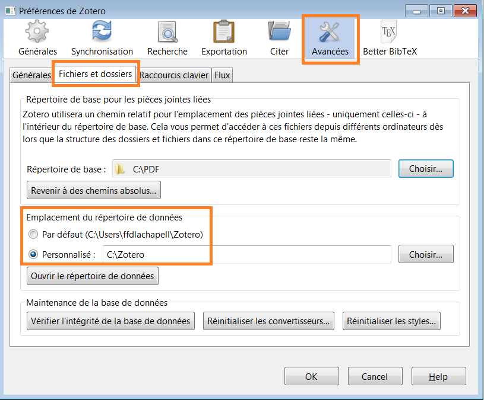

![zotero][zotero] [Documentation Zotero : Le répertoire de données Zotero](https://docs.zotero-fr.org/zotero_data)

## 12. Conclusion

### Des questions?

* Lisez la **documentation**! Certaines pages sont disponibles uniquement en anglais, mais la documentation est exhaustive et détaillée. Nous vous recommandons comme point de départ la page d'accueil de la version francophone documentation : https://docs.zotero-fr.org.
* Vous rencontrez une difficulté? Vous n'êtes probablement pas le premier ni le seul, consultez le **forum** et créez si besoin une nouvelle discussion : [Forum Zotero](https://forums.zotero.org/)

![zotero][zotero] [Documentation Zotero : Obtenir de l'aide](https://docs.zotero-fr.org/getting_help)

[zotero]: img/icone_zotero.png


### Aller plus loin

Nous avons parcouru les principale fonctionnalités de Zotero, mais Zotero peut faire bien plus encore pour devenir votre assistant de recherche personnel.

Vous trouverez un premier ensemble de trucs et astuces pour optimiser et augmenter votre usage de Zotero dans les billets du [blog Zotero francophone](https://zotero.hypotheses.org/).

![zotero][zotero] Dans la documentation Zotero, la rubrique [Tirer le meilleur parti de Zotero](https://docs.zotero-fr.org/locate/) constitue un bon point de départ pour explorer toutes les potentialités du logiciel.

#### Configurer l'option "Rechercher dans la bibliothèque"

Dans cette rubrique "Tirer le meilleur parti de Zotero", le paramétrage de l'OpenURL de votre institution est un exemple de réglage complémentaire simple à effectuer, source de gain de temps et d'efficacité pour localiser le texte intégral d'une ressource et y accéder.

Dans l'onglet _Préférences_>_Avancées_ > _Générales_ , rubrique _OpenURL_, ouvrez le menu déroulant et naviguez dans la liste géographique pour sélectionner votre établissement.


Cela vous permettra de générer la page du système documentaire de votre établissement (Babord+ dans les universités de Bordeaux) correspondant au document sélectionné dans votre bibliothèque Zotero. Cette page affiche toutes les options d'accès disponibles dans votre établissement, et vous pourrez ainsi trouver des PDF que Zotero ne sera pas parvenu à télécharger automatiquement.

Il vous suffira pour cela de cliquer sur _Recherche dans la bibliothèque_, accessible depuis le menu _Localiser_, c'est-à-dire la flèche verte en haut du volet de droite dans votre bibliothèque Zotero.

![zotero][zotero] [Documentation Zotero : Le menu Localiser](https://docs.zotero-fr.org/locate)


#### Ajouter des moteurs de recherche intégrés à Zotero

Le menu _Localiser_ donne également accès à des moteurs de recherche intégrés à Zotero.

Vous trouverez des informations détaillées concernant cette fonctionnalité ainsi que **des fichiers configurés prêts à l'emploi** dans le billet du blog Zotero francophone [Les moteurs de recherche intégrés à Zotero](https://zotero.hypotheses.org/3388).

#### Zotero sans Zotero, ZoteroBib

Billet du blog Zotero francophone : [Lancement de ZoteroBib : créez vos bibliographies en un clin d’oeil](https://zotero.hypotheses.org/1795)

# Crédits

<a rel="license" href="http://creativecommons.org/licenses/by-sa/3.0/fr/"></a><br />Ce document est mis à disposition selon les termes de la <a rel="license" href="http://creativecommons.org/licenses/by-sa/3.0/fr/">Licence Creative Commons Attribution -  Partage dans les Mêmes Conditions 3.0 France</a>.

**Auteur**

Frédérique Flamerie

**Visuels**

Site [Zotero](https://www.zotero.org/)
